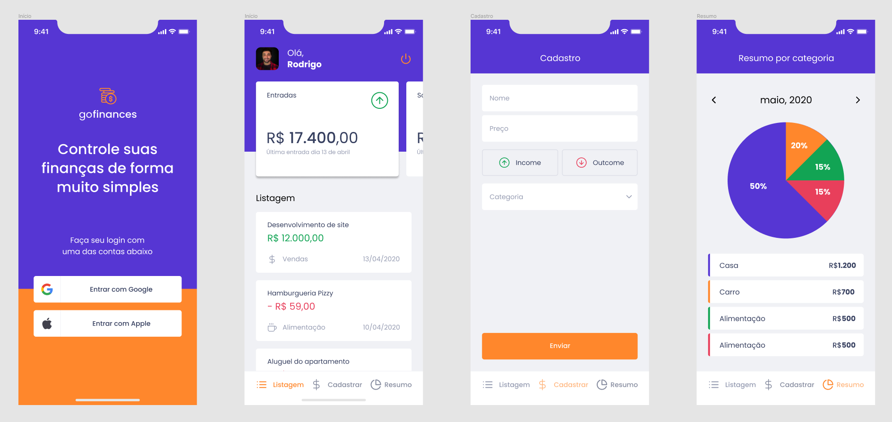

# GoFinances 💜 |  feito com React Native 

&nbsp;



## 📚 Informações sobre o projeto

- Esse projeto foi desenvolvido durante um dos capitulos do Ignite da Rocketseat! A ideia era desenvolver um aplicativo com expo, para gerenciamento de finanças.

&nbsp;

## 🛠️ Tecnologias/Ferramentas ultilizadas

- [React](https://pt-br.reactjs.org/E)
- [React Native](https://reactnative.dev/)
- [Expo](https://expo.dev/)
- [Styled-components](https://styled-components.com/)
- [date-fns](https://date-fns.org/)
- [expo-apple-authentication](https://docs.expo.dev/versions/latest/sdk/apple-authentication/)
- [expo-auth-session](https://docs.expo.dev/versions/latest/sdk/auth-session/)
- [yup](https://github.com/jquense/yup)
- [jest-expo](https://docs.expo.dev/guides/testing-with-jest/)

&nbsp;

## ⚙️ Instalação

```
# Abra um terminal e copie este repositório com o comando
$ git clone https://github.com/Hugovarellaa/gofinances
```

```
# Acesse a pasta da aplicação
$ cd gofinances

# Instale as dependências
$ yarn

# Inicie a aplicação no android
$ yarn start
$ yarn android


# Inicie a aplicação IOS
$ yarn ios
```

&nbsp;

---

<p align="center">Feito com 💙 por  Hugo Alves Varella</p>
